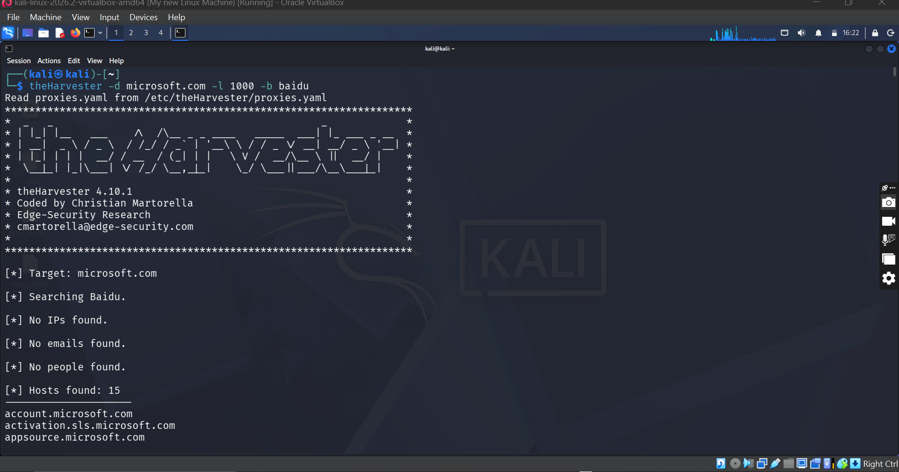
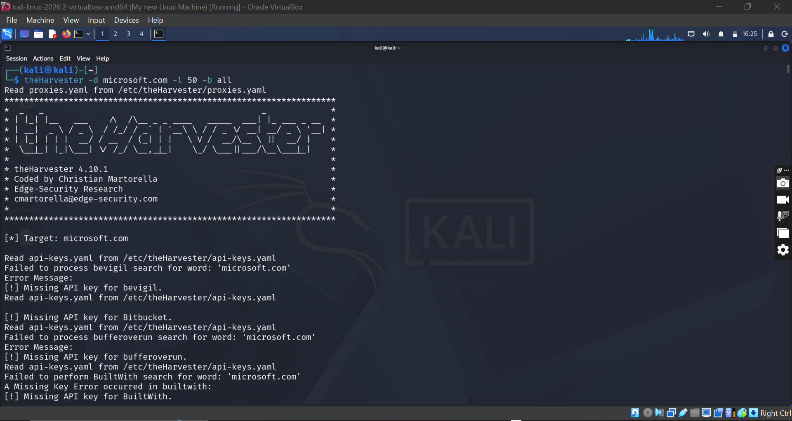
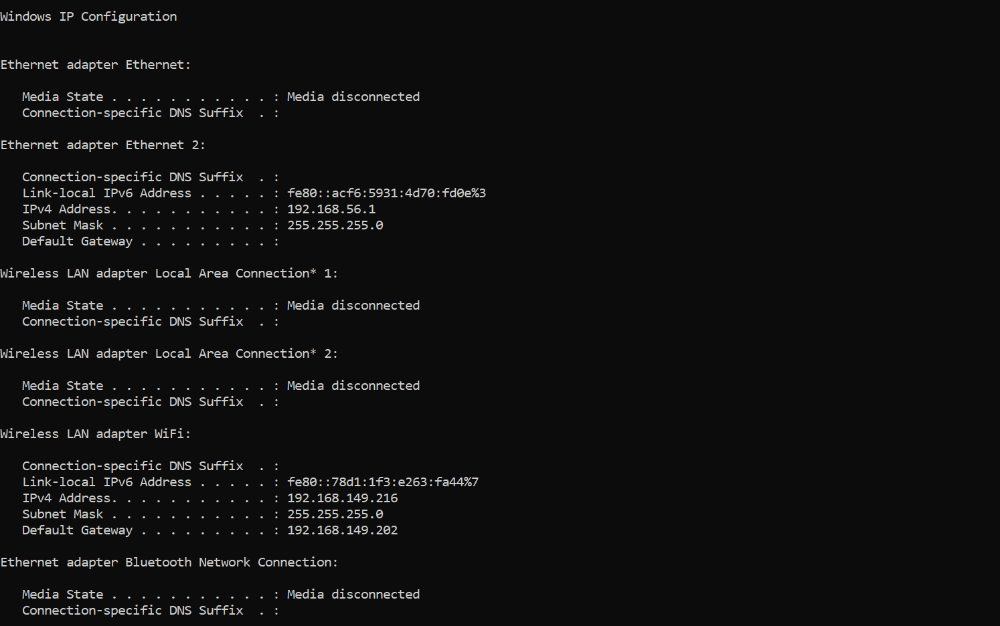
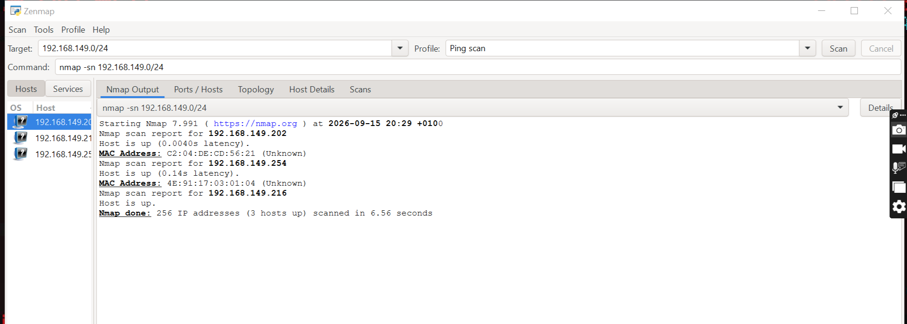
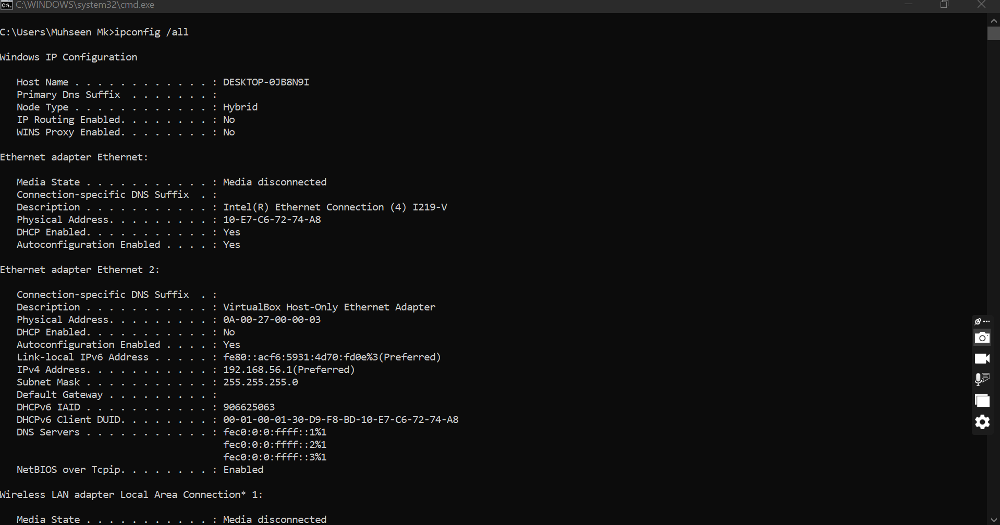
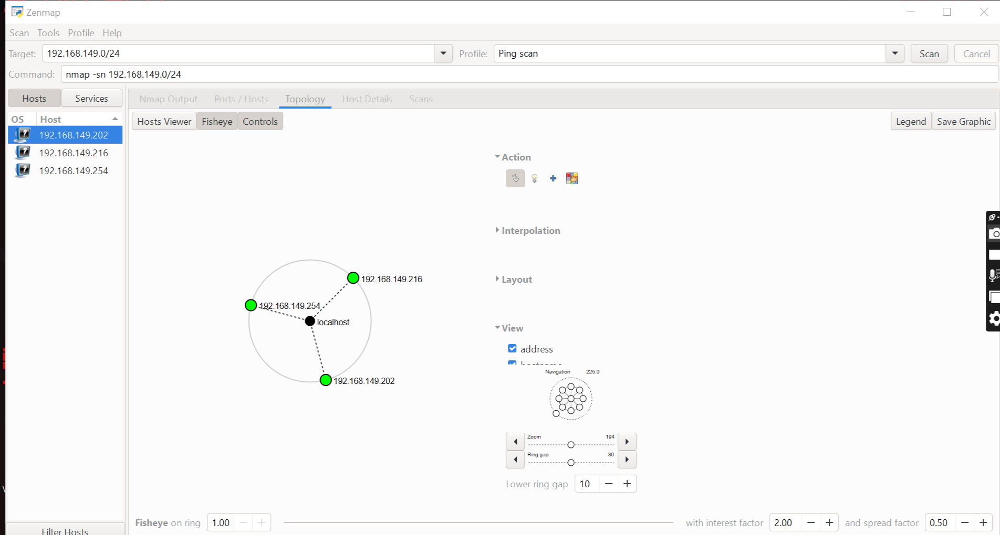

````markdown
# 🔍 Footprinting & Network Scanning

**Student:** Muhammad Muhsin Khamis  
**Program:** Cybersecurity  
**Platform:** NetworkWalks  
**Batch:** B083C  
**Week:** 02  
**Projects:** Footprinting with theHarvester (W2-PM4) & Network Scanning with Zenmap (W2-PM5)  
**Tutor:** Waqas Karim, CCIE  

---

## 1. Project Overview

This project covered two key phases of a cybersecurity assessment:

1. **Footprinting & Reconnaissance** using **theHarvester** in Kali Linux.
2. **Network Scanning & Host Discovery** using **Zenmap** (the official Nmap GUI) on Windows.

The aim was to demonstrate how an ethical hacker moves from gathering publicly available information about a target domain to mapping live hosts on a local network.

All activities were performed within an authorised educational lab scope.

---

## 2. Objectives

- Use theHarvester to gather email addresses, subdomains, and hosts related to a target organization.
- Compare results from a single source (Baidu) vs. all available sources.
- Install and configure Zenmap on Windows.
- Identify the local IP address and LAN subnet.
- Use Zenmap's Ping Scan profile to discover live hosts.
- Identify IP and MAC addresses of the discovered hosts.
- Save the network topology as a PDF.

---

## 3. Tools Used

| Tool | Purpose |
|---|---|
| Kali Linux | OS used for theHarvester footprinting |
| theHarvester | Passive reconnaissance tool (emails, subdomains, hosts) |
| Windows 11 | OS used for Zenmap network scanning |
| Zenmap (Nmap GUI) | GUI for Nmap used for host discovery and topology mapping |
| Npcap | Packet capture driver bundled with Nmap for Windows |
| Windows CMD (`ipconfig`) | Local IP, subnet mask, and MAC address identification |

---

# 4. Activities Performed

## 4.1 Footprinting with theHarvester

### Task 1 — Baidu, Limit 1000

**Command:**

```bash
theHarvester -d microsoft.com -l 1000 -b baidu
````

**Flag meanings:**

* `-d` → target domain
* `-l` → result limit
* `-b` → data source

### Result Summary

* No IPs found
* No emails found
* No people found
* 14 hosts/subdomains found

Examples:

```text
appsource.microsoft.com
developer.microsoft.com
learn.microsoft.com
```

### Evidence



---

### Task 2 — All Sources, Limit 50

**Command:**

```bash
theHarvester -d microsoft.com -l 50 -b all
```

### Result Summary

* ASNs found: 6
* IPs found: 141
* Emails found: 3
* People found: none
* Hosts found: 9,967

**Note:** Many sources returned `[!] Missing API key` messages. This is expected because those sources require API keys that are not configured in this lab.

theHarvester still collected results from sources that don't require authentication, such as Baidu, DuckDuckGo, CRTsh, etc.

### Evidence



---

# 4.2 Network Scanning with Zenmap

## Task 1 — Download & Install Zenmap

Zenmap was downloaded from the official website:

[https://nmap.org/download.html](https://nmap.org/download.html)

The Windows self-installer used was:

```text
nmap-7.991-setup.exe
```

The Npcap driver was installed alongside it.

---

## Task 2 — Local IP Address & LAN Subnet

**Command used in CMD:**

```cmd
ipconfig
```

### Result

| Information        | Value              |
| ------------------ | ------------------ |
| Local IPv4 Address | `192.168.149.216`  |
| Subnet Mask        | `255.255.255.0`    |
| LAN Subnet         | `192.168.149.0/24` |
| Default Gateway    | `192.168.149.202`  |

### Evidence



---

## Task 3 — Live Hosts in the Subnet

The following Ping Scan was executed via Zenmap:

```text
nmap -sn 192.168.149.0/24
```

### Result

**3 hosts up.**

### Evidence



---

## Task 4 — How Many Hosts Are Live?

**3 hosts are live**, including my own PC.

---

## Task 5 — IP Addresses of the Live Hosts

```text
192.168.149.202
192.168.149.254
192.168.149.216
```

---

## Task 6 — MAC Addresses of the Live Hosts

```text
192.168.149.202  →  C2:04:DE:CD:56:21
192.168.149.254  →  4E:91:17:03:01:04
192.168.149.216  →  B8:08:CF:DC:D5:98
```

`192.168.149.216` is my own PC.

The MAC address of my own PC was obtained using:

```cmd
ipconfig /all
```

### Evidence



---

## Task 7 — Save Topology as PDF

The **Topology** tab in Zenmap was opened, the **Legend** was enabled, and the topology was saved as a PDF on the Desktop.

### Evidence


📄 **[Download the saved topology PDF](zenmap-topology.pdf)**

**Note:** In a Ping scan, Zenmap only knows which hosts are alive — it does not know the route/path between them (that requires traceroute). As a result, the topology may show hosts as separate/isolated nodes rather than a connected map.

---

# 5. Risk Analysis / Impact

| # | Risk / Finding                 | Evidence                                              | Potential Impact                                 | Risk Level |
| - | ------------------------------ | ----------------------------------------------------- | ------------------------------------------------ | ---------- |
| 1 | Public email addresses exposed | theHarvester found 3 email addresses on microsoft.com | Possible phishing targets                        | Medium     |
| 2 | Large subdomain footprint      | theHarvester found 9,967 subdomains                   | Expanded attack surface for defenders to monitor | Medium     |
| 3 | ASN and IP exposure            | 6 ASNs and 141 IPs discovered                         | Reveals infrastructure range                     | Low        |
| 4 | Live hosts visible on LAN      | Zenmap found 3 hosts on the subnet                    | Unknown devices may exist on the network         | Medium     |
| 5 | MAC addresses of local hosts   | Nmap revealed MAC of gateway and second host          | Used for device fingerprinting                   | Low        |

**Risk Level Key:** Critical / Medium / Low

These are observations from passive reconnaissance and host discovery only. No exploitation was performed.

---

# 6. Recommendations

* Review what information about web technologies, subdomains, and email addresses is publicly exposed.
* Apply email filtering and anti-phishing controls.
* Monitor subdomain registrations and expired DNS records regularly.
* Periodically scan internal networks to identify unexpected devices.
* Investigate unknown MAC addresses discovered during scans.
* Maintain up-to-date network documentation.
* Perform reconnaissance and scanning only with authorisation.

---

# 7. Conclusion

In Week 2, I completed practical exercises covering passive footprinting and active network scanning.

Using theHarvester, I learned how much information about an organisation can be gathered from public sources without touching the target directly — email addresses, subdomains, ASNs, and IPs. I also saw how much results vary depending on which source is used, and how many sources require API keys to function fully.

Using Zenmap, I learned how to perform a Ping scan against my own subnet to discover live hosts, retrieve their IP and MAC addresses, and generate a network topology. I understood the difference between knowing which hosts are alive (Ping scan) and knowing how they connect (traceroute).

Both exercises reinforced an important principle: reconnaissance and scanning are the foundation of every ethical hacking assessment — and they must always be performed within an authorised scope.

---

# 8. Security & Ethical Use

This project was completed as part of an authorised educational lab at NetworkWalks.

All activities were performed against:

### theHarvester

The `microsoft.com` domain was explicitly provided as the target in the lab instructions.

**Purpose:** Passive reconnaissance only.

### Zenmap

My own local network was used for the network scanning activities.

No exploitation, credential attacks, or unauthorised access were performed.

---

# 9. Repository Structure

```text
.
.
├── README.md
├── theharvester-task1-baidu.png
├── theharvester-task2-all.png
├── zenmap-task2-ipconfig.png
├── zenmap-task3-ping-scan.png
├── zenmap-task6-ipconfig-all.png
├── zenmap-task7-topology.png
└── zenmap-topology.pdf
```

```
```
